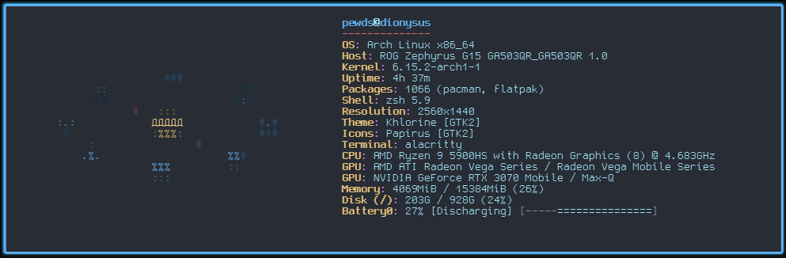

# Dionysus Dotfiles
───────────────────────────────────────────────  
 °˖* ૮( • ᴗ ｡)っ🍸 shheersh - Dionysus vers. 1.0   
 ───────────────────────────────────────────────  
 ``` 
                  ) ) )                     ) ) )
                ( ( (                      ( ( (
              ) ) )                       ) ) )
           (~~~~~~~~~)                 (~~~~~~~~~)
            |   А   |                   |   Б   |
            |       |                   |       |
            I      _._                  I       _._
            I    /'   `\                I     /'   `\
            I   |   N   |               I    |   N   |
            f   |   |~~~~~~~~~~~~~~|    f    |    |~~~~~~~~~~~~~~|
          .'    |   ||~~~~~~~~|    |  .'     |    | |~~~~~~~~|   |
        /'______|___||__###___|____|/'_______|____|_|__###___|___|                  
                 ) ) )                     ) ) )
                ( ( (                      ( ( (
              ) ) )                       ) ) )
           (~~~~~~~~~)                 (~~~~~~~~~)
            |   В   |                   |   Д   |
            |       |                   |       |
            I      _._                  I       _._
            I    /'   `\                I     /'   `\
            I   |   N   |               I    |   N   |
            f   |   |~~~~~~~~~~~~~~|    f    |    |~~~~~~~~~~~~~~|
          .'    |   ||~~~~~~~~|    |  .'     |    | |~~~~~~~~|   |
        /'______|___||__###___|____|/'_______|____|_|__###___|___|
``` 
# Добро пожаловать, командир.  
Rice config for **Hyprland** on Arch Linux,  
running on my **ROG Zephyrus G15** (_dionysus_). 

## Features
  - Animated **Neofetch**  
  - Dynamic **Waybar**  
  - ASCII **Cava Visualizer**  
  - Nord-inspired **neon-radioactive theme**  

## Demo

### Neofetch


### Eww


### Rofi


### Cava


### Alacritty + Waybar

### Waybar


### Hyprland


##  Contents
- [alacritty](dotfiles/alacritty/) → terminal config  
- [cava](dotfiles/cava/) → audio visualizer  
- [eww](dotfiles/eww/) → HUD & widgets  
- [firefox](dotfiles/firefox/) → browser theme  
- [hypr](dotfiles/hypr/) → window manager  
- [neofetch](dotfiles/neofetch/) → animated fetch  
- [rofi](dotfiles/rofi/) → launcher + powermenu  
- [waybar](dotfiles/waybar/) → status bar  
- [zsh](dotfiles/zsh/) → shell configs   

## Installation
### Prerequisites
- **Arch Linux** (or compatible distribution)
- **Hyprland** and related Wayland tools
- **Nerd Fonts** for icons
- Basic development tools (git, curl, etc.)

### Quick Setup
1. Clone the repository:
   ```bash
   git clone https://github.com/pewdiepie-archdaemon/dionysus.git
   cd dionysus
   ```

2. Backup your existing configs:
   ```bash
   mkdir ~/.config.backup
   cp -r ~/.config/* ~/.config.backup/
   ```

3. Install the dotfiles:
   ```bash
   cp -r dotfiles/* ~/.config/
   ```

4. Make scripts executable:
   ```bash
   find ~/.config -name "*.sh" -exec chmod +x {} \;
   ```

5. Install required packages:
   ```bash
   # Core components
   sudo pacman -S hyprland hyprpaper eww cava rofi alacritty thunar firefox

   # Utilities
   sudo pacman -S grim slurp wl-clipboard wpctl playerctl brightnessctl lm-sensors curl
   sudo pacman -S pactl nm-connection-editor nordvpn

   # Audio/Video
   sudo pacman -S pipewire pipewire-pulse pipewire-alsa

   # Fonts
   sudo pacman -S ttf-nerd-fonts-symbols ttf-jetbrains-mono
   ```

## Requirements
  - **Hyprland** (Wayland compositor & WM)
  - **Hyprpaper** (wallpaper daemon for Hyprland)
  - **eww** (Elkowar’s Wacky Widgets)
  - **cava** (audio visualizer)
  - **rofi** (application launcher)
  - **alacritty** (terminal emulator)
  - **thunar** (file manager)
  - **firefox** (browser, with custom profile support)
  - **grim** (Wayland screenshot tool)
  - **slurp** (Wayland region selector)
  - **wl-clipboard** (for `wl-copy`)
  - **wpctl** (PipeWire volume control)
  - **playerctl** (media player control)
  - **brightnessctl** (backlight control)
  - **lm-sensors** (for temps, fans, voltages)
  - **curl** (network requests in scripts)
  - **Nerd Font** for icons

## Theme
**Nord-inspired neon-radioactive color palette:**

- **Background**: Deep navy (#0a0a0f)
- **Foreground**: Electric blue (#7dcfff)
- **Accent**: Neon green (#39ff14)
- **Secondary**: Radioactive yellow (#ffff00)
- **Tertiary**: Cyber pink (#ff1493)

## Key Bindings (Hyprland)
- **Super + Q**: Kill window
- **Super + Space**: Toggle floating
- **Super + Return**: Launch terminal
- **Super + D**: Launch Rofi
- **Super + Tab**: Cycle windows

## Scripts
- `waybar_watcher.sh`: Manages Waybar and EWW processes
- `audio_visualizer.py`: Processes Cava output for EWW
- ASUS keyboard scripts: Brightness, breathing, profile cycling

## Customization
Each component can be customized independently:

1. **Colors**: Edit SCSS files in `eww/` and `waybar/`
2. **Keybindings**: Modify `hyprland.conf`
3. **Scripts**: Update shell scripts in respective directories
4. **Themes**: Adjust color schemes in config files

## Resources
- [Hyprland Documentation](https://hyprland.org/)
- [EWW GitHub](https://github.com/elkowar/eww)
- [Cava GitHub](https://github.com/karlstav/cava)
- [Nord Theme](https://www.nordtheme.com/)

---

<div align="center">

**Built with ❤️ on Arch Linux**

*Cheers to the open source community! 🍸*

</div>
