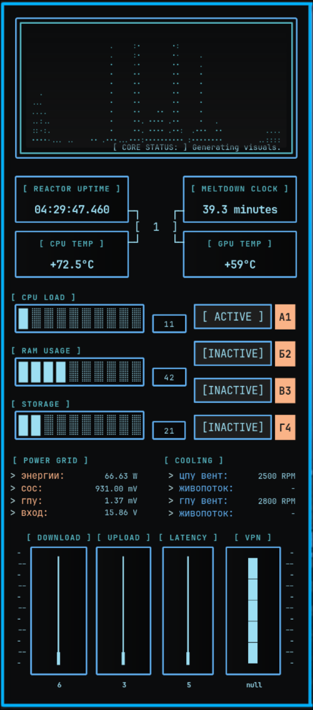
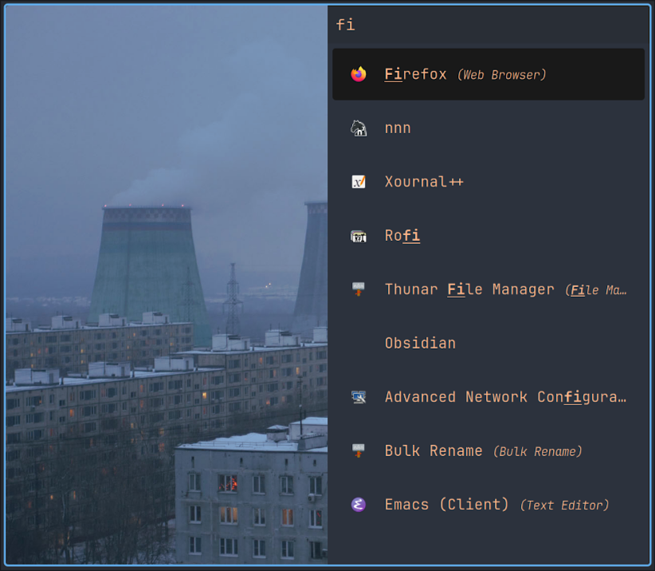
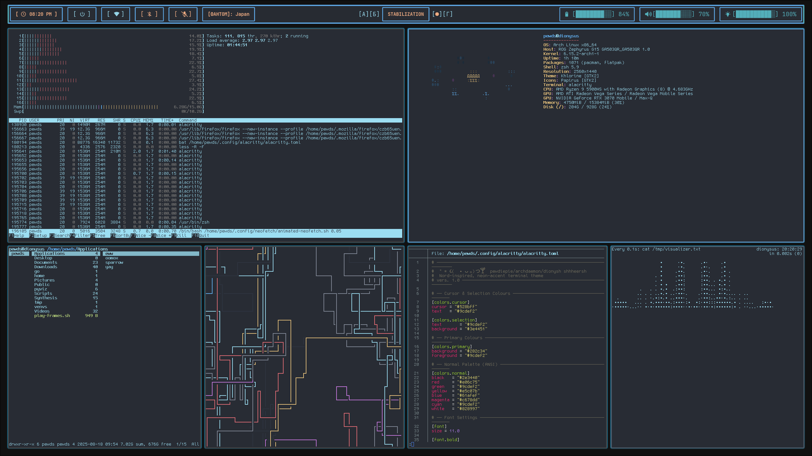

# Dionysus
───────────────────────────────────────────────  
 °˖* ૮( • ᴗ ｡)っ🍸 shheersh - Dionysus vers. 1.0   
 ───────────────────────────────────────────────  
 ``` 
                  ) ) )                     ) ) )
                ( ( (                      ( ( (
              ) ) )                       ) ) )
           (~~~~~~~~~)                 (~~~~~~~~~)
            |   А   |                   |   Б   |
            |       |                   |       |
            I      _._                  I       _._
            I    /'   `\                I     /'   `\
            I   |   N   |               I    |   N   |
            f   |   |~~~~~~~~~~~~~~|    f    |    |~~~~~~~~~~~~~~|
          .'    |   ||~~~~~~~~|    |  .'     |    | |~~~~~~~~|   |
        /'______|___||__###___|____|/'_______|____|_|__###___|___|                  
                 ) ) )                     ) ) )
                ( ( (                      ( ( (
              ) ) )                       ) ) )
           (~~~~~~~~~)                 (~~~~~~~~~)
            |   В   |                   |   Д   |
            |       |                   |       |
            I      _._                  I       _._
            I    /'   `\                I     /'   `\
            I   |   N   |               I    |   N   |
            f   |   |~~~~~~~~~~~~~~|    f    |    |~~~~~~~~~~~~~~|
          .'    |   ||~~~~~~~~|    |  .'     |    | |~~~~~~~~|   |
        /'______|___||__###___|____|/'_______|____|_|__###___|___|
``` 
# Добро пожаловать, командир.  
Rice config for **Hyprland** on Arch Linux,  
running on my **ROG Zephyrus G15** (_dionysus_). 

## Features
  - Animated **Neofetch**  
  - Dynamic **Waybar**  
  - ASCII **Cava Visualizer**  
  - Nord-inspired **neon-radioactive theme**  

## Demo

### Neofetch

### Eww

### Rofi

### Cava

### Alacritty + Waybar


##  Contents
- [alacritty](dotfiles/alacritty/) → terminal config  
- [cava](dotfiles/cava/) → audio visualizer  
- [eww](dotfiles/eww/) → HUD & widgets  
- [firefox](dotfiles/firefox/) → browser theme  
- [hypr](dotfiles/hypr/) → window manager  
- [neofetch](dotfiles/neofetch/) → animated fetch  
- [rofi](dotfiles/rofi/) → launcher + powermenu  
- [waybar](dotfiles/waybar/) → status bar  
- [zsh](dotfiles/zsh/) → shell configs  
