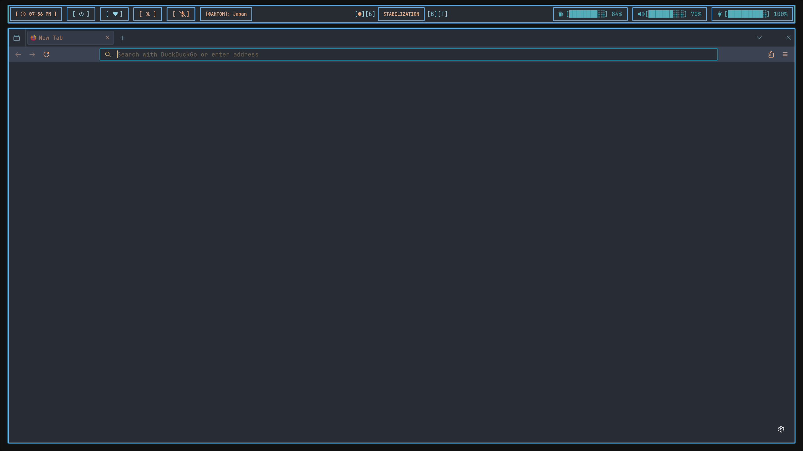

# Firefox Browser Theme Configuration

<div align="center">



**Cyberpunk browser theme matching the Dionysus aesthetic**

</div>

## Overview

This Firefox configuration provides a custom color theme that seamlessly integrates with the Dionysus desktop environment. The theme features the signature neon-radioactive color palette with Nord-inspired accents.

## Files Structure

```
firefox/
├── theme.zip                  # Complete Firefox color theme package
└── README.md                  # This documentation
```

## Theme Features

### Visual Design
- **Dark interface** matching the desktop background
- **Electric blue accents** for active elements
- **Neon green highlights** for important UI components
- **Consistent color palette** with other Dionysus components

### UI Elements Themed
- **Tab bar** with custom colors and hover effects
- **Address bar** with matching background and text colors
- **Sidebar** themed for bookmarks and history
- **Context menus** with consistent styling
- **Toolbar buttons** with accent color highlights

## Color Palette

The Firefox theme uses the core Dionysus color scheme:

| Element | Color | Hex Code | Usage |
|---------|-------|----------|-------|
| **Background** | Deep Navy | `#0a0a0f` | Primary interface background |
| **Text** | Electric Blue | `#7dcfff` | Primary text and icons |
| **Accent** | Neon Green | `#39ff14` | Active tabs and highlights |
| **Secondary** | Radioactive Yellow | `#ffff00` | Warnings and notifications |
| **Borders** | Cyber Pink | `#ff1493` | Selection and focus indicators |

## Installation Methods

### Method 1: Web Installation (Recommended)
```
https://color.firefox.com/?theme=XQAAAAJOAQAAAAAAAABBqYhm849SCia48_6EGccwS-xMDPr-IdilzwjPpwYYQ6kJks1tHkOna0kLPE4FFXAtNVM1RoyVPNW--Ax2MtgkvCFFaSo4JFgSOCn_6DR6tGSSaiQ9O6s38npljEdz-XUIBO6s2I5fjNHdE3EXon06TlOwydaieF_p2g7tZiQj6mZcoPDVINemEmT7KwdNwmnF2x1EgVnBfnCA3SrPd6IuK1bfUR0kuChK1n1WOLqN-fx3ZxhQkaTF_KkSWNhs9hLFUJ-3f5kF_hfx-knFcCtna-MRZwXXyNv_0t5oAA
```

1. Open the URL in Firefox
2. Click **"Install Theme"**
3. Theme will be applied immediately

### Method 2: Local Installation
```bash
# Extract theme package
cd ~/.config/firefox/
unzip theme.zip

# Apply through Firefox preferences
# about:preferences → General → Extensions & Themes
```

### Method 3: Manual Import
1. Open Firefox
2. Navigate to `about:addons`
3. Click the gear icon → **"Install Add-on From File"**
4. Select `theme.zip` from the firefox directory
5. Click **"Add"** to install

## Theme Components

### Tab Bar Styling
- **Active tab**: Neon green background with dark text
- **Inactive tabs**: Dark background with electric blue text
- **Hover effects**: Subtle glow with accent colors
- **Close buttons**: Cyber pink highlights on hover

### Address Bar (Omnibar)
- **Background**: Deep navy matching desktop
- **Text**: Electric blue for URLs and search
- **Suggestions**: Themed dropdown with consistent colors
- **Security indicators**: Color-coded for HTTPS/HTTP

### Toolbar Elements
- **Navigation buttons**: Styled with accent colors
- **Bookmark bar**: Dark background with readable text
- **Extension buttons**: Consistent with overall theme
- **Menu button**: Themed to match other UI elements

## Advanced Customization

### Custom CSS (Optional)
For users wanting deeper customization, create a `userChrome.css` file:

```css
/* Firefox userChrome.css for advanced theming */
@namespace url("http://www.mozilla.org/keymaster/gatekeeper/there.is.only.xul");

/* Tab bar customization */
.tab-background[selected="true"] {
  background: linear-gradient(135deg, #39ff14, #7dcfff) !important;
}

/* Address bar glow effect */
#urlbar[focused="true"] {
  box-shadow: 0 0 10px #39ff14 !important;
  border: 1px solid #39ff14 !important;
}

/* Sidebar styling */
#sidebar-header {
  background: #0a0a0f !important;
  color: #7dcfff !important;
}
```

### Creating userChrome.css
```bash
# Navigate to Firefox profile directory
cd ~/.mozilla/firefox/*.default-release/

# Create chrome directory
mkdir -p chrome

# Create userChrome.css
touch chrome/userChrome.css

# Enable custom CSS in Firefox
# about:config → toolkit.legacyUserProfileCustomizations.stylesheets → true
```

## Browser Optimization

### Performance Settings
Optimize Firefox for the Dionysus environment:

```javascript
// about:config settings for performance
user_pref("gfx.webrender.all", true);                    // Enable WebRender
user_pref("layers.acceleration.force-enabled", true);     // Force GPU acceleration
user_pref("media.ffmpeg.vaapi.enabled", true);          // Hardware video decoding
```

### Privacy Enhancements
```javascript
// Enhanced privacy settings
user_pref("privacy.trackingprotection.enabled", true);
user_pref("browser.safebrowsing.malware.enabled", true);
user_pref("dom.security.https_only_mode", true);
```

## Extension Recommendations

### Theme-Compatible Extensions
- **Dark Reader** - Dark mode for websites
- **uBlock Origin** - Ad blocker with dark UI
- **Stylus** - Custom website styling
- **Tree Style Tab** - Sidebar tab management

### Installation
```bash
# Extensions that complement the theme
firefox "https://addons.mozilla.org/firefox/addon/darkreader/"
firefox "https://addons.mozilla.org/firefox/addon/ublock-origin/"
```

## Integration with Desktop

### Window Rules (Hyprland)
```bash
# Add to hyprland.conf for seamless integration
windowrule = opacity 0.95,^(firefox)$
windowrule = animation slide,^(firefox)$
```

### Startup Configuration
```bash
# Auto-start Firefox with specific profile
exec-once = firefox --profile ~/.mozilla/firefox/dionysus.profile
```

## Troubleshooting

### Theme Not Applying
```bash
# Clear Firefox cache
rm -rf ~/.cache/mozilla/firefox/

# Reset theme preferences
# about:preferences → General → Extensions & Themes → Reset
```

### Performance Issues
```bash
# Disable hardware acceleration if needed
# about:preferences → General → Performance → Uncheck "Use recommended performance settings"
```

### Color Inconsistencies
1. Check display color profile settings
2. Verify monitor gamma settings
3. Restart Firefox after theme changes

## Custom Profile Setup

### Creating Dedicated Profile
```bash
# Create new Firefox profile for Dionysus
firefox -CreateProfile "dionysus /home/$USER/.mozilla/firefox/dionysus"

# Launch with specific profile
firefox -P dionysus
```

### Profile Configuration
```javascript
// Dionysus-specific preferences
user_pref("browser.startup.homepage", "about:blank");
user_pref("browser.newtabpage.enabled", false);
user_pref("browser.theme.content-theme", 0);  // Dark theme
user_pref("browser.theme.toolbar-theme", 0);  // Dark toolbar
```

## Website Compatibility

### Dark Mode CSS
Custom CSS for improved website appearance:

```css
/* Global dark mode improvements */
@-moz-document url-prefix("http://"), url-prefix("https://") {
  html {
    filter: invert(1) hue-rotate(180deg) !important;
  }
  
  img, video, iframe, svg {
    filter: invert(1) hue-rotate(180deg) !important;
  }
}
```

### Site-Specific Overrides
```css
/* Preserve specific website colors */
@-moz-document domain("github.com") {
  html {
    filter: none !important;
  }
}
```

## Development Mode

### Theme Development
For developing custom themes:

```bash
# Enable browser toolbox
# about:config → devtools.chrome.enabled → true
# about:config → devtools.debugger.remote-enabled → true

# Access browser toolbox
# Tools → Browser Tools → Browser Toolbox
```

### Testing Changes
```css
/* Test theme modifications in browser console */
document.documentElement.style.setProperty('--toolbar-bgcolor', '#0a0a0f');
```

## Backup and Restoration

### Backup Current Theme
```bash
# Backup Firefox profile
tar -czf firefox-backup.tar.gz ~/.mozilla/firefox/

# Backup just the theme settings
cp -r ~/.mozilla/firefox/*/extensions/ ~/dionysus-firefox-backup/
```

### Restore Theme
```bash
# Restore from backup
tar -xzf firefox-backup.tar.gz -C ~/

# Or reinstall theme
firefox "https://color.firefox.com/?theme=..."
```

---

<div align="center">

**Part of the Dionysus desktop environment**

*Seamless browser integration with cyberpunk aesthetics*

</div>
