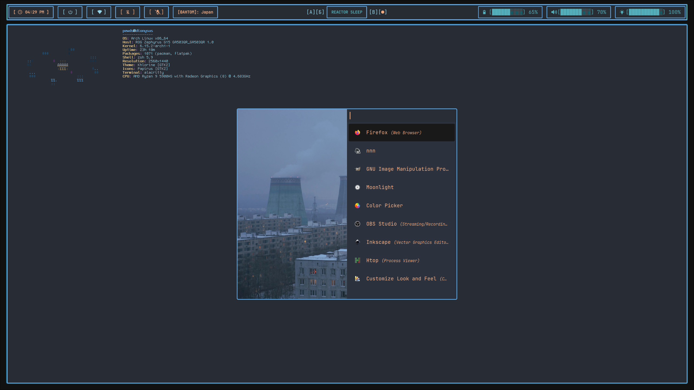

# Rofi Application Launcher Configuration

<div align="center">


**Cyberpunk-themed application launcher and power menu**

</div>

## Overview

This Rofi configuration provides a sleek, cyberpunk-inspired application launcher that seamlessly integrates with the Dionysus desktop environment. The setup includes custom themes, power menu integration, and optimized performance for daily workflow.

## Files Structure

```
rofi/
├── config.rasi               # Main Rofi configuration
├── theme.rasi                # Custom cyberpunk theme
├── image.png                 # Background image for launcher
└── README.md                 # This documentation
```

## Core Features

### 🚀 Application Launcher
- **Fast application search** with fuzzy matching
- **Icon support** with fallback text display
- **Recently used** application prioritization
- **Custom categories** for organized browsing

### ⚡ Power Menu Integration
- **System power controls** (shutdown, restart, logout)
- **Session management** with lock screen integration
- **Hibernate and suspend** options
- **Safe confirmation** prompts for destructive actions

### 🎨 Visual Design
- **Neon-radioactive theme** matching desktop aesthetic
- **Transparent backgrounds** with blur effects
- **Smooth animations** for opening and selection
- **Custom typography** with cyberpunk fonts

### 🔧 Performance Optimization
- **Instant launch** with pre-cached application list
- **Minimal memory footprint** during operation
- **Fast filtering** with optimized search algorithms
- **Responsive UI** even with large application databases

## Configuration Highlights

### Main Configuration (`config.rasi`)
```css
configuration {
    modes: "window,drun,run,ssh";
    font: "JetBrains Mono 12";
    show-icons: true;
    terminal: "alacritty";
    drun-display-format: "{icon} {name}";
    location: 0;
    disable-history: false;
    hide-scrollbar: true;
    sidebar-mode: false;
}

/* Import custom theme */
@theme "~/.config/rofi/theme.rasi"
```

### Theme Configuration (`theme.rasi`)
```css
* {
    /* Dionysus color palette */
    bg-primary:     #0a0a0f;
    bg-secondary:   #1a1a2e;
    fg-primary:     #7dcfff;
    accent-green:   #39ff14;
    accent-yellow:  #ffff00;
    accent-pink:    #ff1493;
    
    /* Font settings */
    font: "JetBrains Mono 12";
    
    /* Base styling */
    background-color: transparent;
    text-color: @fg-primary;
    margin: 0px;
    padding: 0px;
    border: 0px;
}

window {
    transparency: "real";
    background-color: fade(@bg-primary, 90%);
    border: 2px solid @accent-green;
    border-radius: 12px;
    width: 600px;
    location: center;
    anchor: center;
}

mainbox {
    enabled: true;
    spacing: 10px;
    background-color: transparent;
    children: [ "inputbar", "listview" ];
}

inputbar {
    enabled: true;
    spacing: 10px;
    background-color: @bg-secondary;
    border: 1px solid @accent-green;
    border-radius: 8px;
    padding: 8px 16px;
    children: [ "prompt", "entry" ];
}

prompt {
    enabled: true;
    background-color: transparent;
    text-color: @accent-green;
}

entry {
    enabled: true;
    background-color: transparent;
    text-color: @fg-primary;
    cursor: text;
}

listview {
    enabled: true;
    columns: 1;
    lines: 8;
    cycle: true;
    dynamic: true;
    scrollbar: false;
    layout: vertical;
    reverse: false;
    background-color: transparent;
}

element {
    enabled: true;
    spacing: 10px;
    padding: 8px;
    border-radius: 6px;
    background-color: transparent;
    text-color: @fg-primary;
    cursor: pointer;
}

element normal.normal {
    background-color: transparent;
    text-color: @fg-primary;
}

element selected.normal {
    background-color: @accent-green;
    text-color: @bg-primary;
}

element-icon {
    background-color: transparent;
    text-color: inherit;
    size: 24px;
    cursor: inherit;
}

element-text {
    background-color: transparent;
    text-color: inherit;
    cursor: inherit;
    vertical-align: 0.5;
    horizontal-align: 0.0;
}
```

## Usage Examples

### Basic Application Launcher
```bash
# Standard application launcher
rofi -show drun

# Run command launcher
rofi -show run

# Window switcher
rofi -show window

# SSH launcher
rofi -show ssh
```

### Custom Modes

**Power Menu Integration**
```bash
#!/bin/bash
# Power menu script for Waybar integration

options="Lock\nLogout\nSuspend\nHibernate\nReboot\nShutdown"

chosen=$(echo -e $options | rofi -dmenu -i -p "Power Menu:" \
    -theme ~/.config/rofi/theme.rasi)

case $chosen in
    Lock)
        swaylock
        ;;
    Logout)
        hyprctl dispatch exit
        ;;
    Suspend)
        systemctl suspend
        ;;
    Hibernate)
        systemctl hibernate
        ;;
    Reboot)
        systemctl reboot
        ;;
    Shutdown)
        systemctl poweroff
        ;;
esac
```

**Clipboard Manager**
```bash
#!/bin/bash
# Clipboard history with Rofi

cliphist list | rofi -dmenu -p "Clipboard:" \
    -theme ~/.config/rofi/theme.rasi | \
    cliphist decode | wl-copy
```

**Network Manager**
```bash
#!/bin/bash
# WiFi network selection

networks=$(nmcli -t -f SSID dev wifi | grep -v '^$' | sort -u)

selected=$(echo "$networks" | rofi -dmenu -p "WiFi Networks:" \
    -theme ~/.config/rofi/theme.rasi)

if [[ -n "$selected" ]]; then
    nmcli device wifi connect "$selected"
fi
```

## Advanced Customization

### Custom Scripts Integration

**Project Launcher**
```bash
#!/bin/bash
# Quick project directory launcher

PROJECTS_DIR="$HOME/projects"

if [[ ! -d "$PROJECTS_DIR" ]]; then
    notify-send "Error" "Projects directory not found"
    exit 1
fi

project=$(find "$PROJECTS_DIR" -maxdepth 1 -type d -printf '%f\n' | \
    tail -n +2 | \
    rofi -dmenu -i -p "Open Project:" \
        -theme ~/.config/rofi/theme.rasi)

if [[ -n "$project" ]]; then
    alacritty --working-directory "$PROJECTS_DIR/$project" &
    code "$PROJECTS_DIR/$project" &
fi
```

**System Monitor**
```bash
#!/bin/bash
# System monitoring shortcuts

options="htop\nbtop\nnvtop\nsensors\njournalctl\nsystemctl"

chosen=$(echo -e $options | rofi -dmenu -i -p "System Monitor:" \
    -theme ~/.config/rofi/theme.rasi)

case $chosen in
    htop|btop|nvtop)
        alacritty -e $chosen
        ;;
    sensors)
        alacritty -e watch sensors
        ;;
    journalctl)
        alacritty -e journalctl -f
        ;;
    systemctl)
        alacritty -e systemctl status
        ;;
esac
```

### Theme Variants

**Dark Variant**
```css
* {
    bg-primary:   #000000;
    bg-secondary: #111111;
    fg-primary:   #ffffff;
    accent-green: #00ff00;
}
```

**Bright Variant**
```css
* {
    bg-primary:   #0f0f23;
    bg-secondary: #1e1e3f;
    fg-primary:   #ffffff;
    accent-green: #66ff66;
}
```

**Minimal Variant**
```css
window {
    border: 1px solid @accent-green;
    border-radius: 0px;
    background-color: @bg-primary;
}

element selected.normal {
    background-color: @bg-secondary;
    text-color: @accent-green;
}
```

## Keybinding Integration

### Hyprland Integration
```bash
# Add to hyprland.conf
bind = Super, Space, exec, rofi -show drun
bind = Super, R, exec, rofi -show run  
bind = Super, Tab, exec, rofi -show window
bind = Super, V, exec, ~/.config/rofi/scripts/clipboard.sh
bind = Super, Escape, exec, ~/.config/rofi/scripts/power-menu.sh
```

### Waybar Integration
```json
{
    "custom/power": {
        "format": " ⏻ ",
        "tooltip": false,
        "on-click": "~/.config/rofi/scripts/power-menu.sh"
    },
    "custom/launcher": {
        "format": " 🚀 ",
        "tooltip": false,
        "on-click": "rofi -show drun"
    }
}
```

## Performance Optimization

### Application Caching
```bash
# Pre-generate application cache
rofi -show drun -dump-cache

# Clear cache if applications not showing
rm -rf ~/.cache/rofi/
```

### Icon Loading
```css
configuration {
    icon-theme: "Papirus-Dark";
    show-icons: true;
    drun-match-fields: "name,generic,exec,categories,keywords";
}
```

### Search Optimization
```css
configuration {
    matching: "fuzzy";
    sort: true;
    sorting-method: "fzf";
    case-sensitive: false;
}
```

## Troubleshooting

### Common Issues

**Rofi not starting:**
```bash
# Test configuration
rofi -dump-config

# Check for syntax errors
rofi -rasi-validate ~/.config/rofi/theme.rasi
```

**Icons not displaying:**
```bash
# Install icon theme
sudo pacman -S papirus-icon-theme

# Set icon theme in config
echo 'configuration { icon-theme: "Papirus-Dark"; }' >> ~/.config/rofi/config.rasi
```

**Theme not applying:**
```bash
# Verify theme path
ls -la ~/.config/rofi/theme.rasi

# Test with inline theme
rofi -show drun -theme ~/.config/rofi/theme.rasi
```

**Slow application search:**
```bash
# Rebuild desktop file cache
update-desktop-database ~/.local/share/applications/

# Clear Rofi cache
rm -rf ~/.cache/rofi/
```

### Performance Tuning

**For large application lists:**
```css
configuration {
    max-history-size: 50;
    run-list-command: "";
    run-command: "{cmd}";
}
```

**For slower systems:**
```css
configuration {
    lazy-grab: true;
    show-icons: false;
}
```

## Advanced Features

### Multi-Monitor Support
```css
configuration {
    monitor: "primary";  /* Display on primary monitor */
    /* monitor: 0; */     /* Display on monitor 0 */
    /* monitor: -1; */    /* Display on focused monitor */
}
```

### Custom Modi
```bash
# Create custom modi script
cat > ~/.config/rofi/modi/calculator.sh << 'EOF'
#!/bin/bash
if [[ -z "$1" ]]; then
    echo "Enter calculation:"
else
    result=$(echo "$1" | bc -l 2>/dev/null)
    echo "$1 = $result"
fi
EOF

chmod +x ~/.config/rofi/modi/calculator.sh

# Add to configuration
echo 'configuration { modi: "drun,calc:~/.config/rofi/modi/calculator.sh"; }' >> ~/.config/rofi/config.rasi
```

### Plugin Integration
```bash
# Install emoji plugin
sudo pacman -S rofi-emoji

# Install calc plugin  
sudo pacman -S rofi-calc

# Install file browser plugin
yay -S rofi-file-browser-extended-git
```

## Scripting Examples

### Quick Note Taker
```bash
#!/bin/bash
# Quick note taking with Rofi

NOTES_DIR="$HOME/Documents/notes"
mkdir -p "$NOTES_DIR"

note=$(rofi -dmenu -p "Quick Note:" \
    -theme ~/.config/rofi/theme.rasi)

if [[ -n "$note" ]]; then
    echo "[$(date)] $note" >> "$NOTES_DIR/quick-notes.txt"
    notify-send "Note Saved" "$note"
fi
```

### Color Picker Integration
```bash
#!/bin/bash
# Color picker with Rofi display

color=$(hyprpicker)
colors_list="$HOME/.config/rofi/colors.txt"

# Add to colors list
echo "$color" >> "$colors_list"

# Show color with Rofi
echo "$color" | rofi -dmenu -p "Picked Color:" \
    -theme ~/.config/rofi/theme.rasi

# Copy to clipboard
echo "$color" | wl-copy
```

## Dependencies

### Required Packages
```bash
# Core Rofi
sudo pacman -S rofi-wayland

# Icon support
sudo pacman -S papirus-icon-theme

# Clipboard integration
sudo pacman -S wl-clipboard cliphist

# Notification support
sudo pacman -S libnotify
```

### Optional Enhancements
```bash
# Additional plugins
sudo pacman -S rofi-emoji rofi-calc

# Enhanced functionality
sudo pacman -S bc imagemagick

# Development tools
sudo pacman -S nodejs python
```

---

<div align="center">



**Part of the Dionysus desktop environment**

*Fast and elegant application launching with cyberpunk style*

</div>
