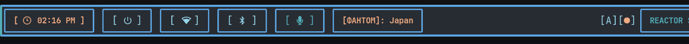
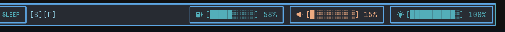

# Waybar Status Bar Configuration

<div align="center">


**Comprehensive status bar with cyberpunk aesthetics and intelligent modules**

</div>

## Overview

This Waybar configuration provides a feature-rich status bar that serves as the primary system interface for the Dionysus desktop environment. It includes interactive modules for system monitoring, quick controls, and workspace management.

## Files Structure

```
waybar/
├── config                     # Main Waybar configuration
├── style.css                  # Styling and themes
├── scripts/                   # Module scripts and utilities
│   ├── asus-profile.sh        # ASUS performance profile control
│   ├── battery.sh             # Advanced battery monitoring
│   ├── bluetooth-toggle.sh    # Bluetooth connectivity control
│   ├── brightness-toggle.sh   # Display brightness management
│   ├── brightness.sh          # Brightness slider integration
│   ├── mic.sh                 # Microphone control and status
│   ├── nordvpn-status.sh      # VPN connection monitoring
│   ├── nordvpn-toggle.sh      # VPN control interface
│   ├── powermenu.sh           # System power options
│   ├── volume.sh              # Audio volume control
│   └── workspaces/            # Workspace management scripts
│       ├── workspace-1.sh     # Workspace 1 controller
│       ├── workspace-2.sh     # Workspace 2 controller
│       ├── workspace-3.sh     # Workspace 3 controller
│       └── workspace-4.sh     # Workspace 4 controller
└── README.md                  # This documentation
```

## Core Features

### 🖥️ Workspace Management
- **Visual workspace indicators** with active/inactive states
- **Click-to-switch** functionality for each workspace
- **Window count** display per workspace
- **Smart highlighting** based on current activity

### 🔋 System Monitoring
- **Battery status** with percentage and time remaining
- **CPU usage** with temperature warnings
- **Memory usage** with available/total display
- **Network status** with bandwidth monitoring

### 🎵 Media Controls
- **Volume control** with scroll wheel and click actions
- **Microphone mute** toggle with visual feedback
- **Media player** integration with playback controls
- **Audio device** switching capabilities

### 🌐 Connectivity
- **Network status** with connection quality indicators
- **VPN status** with automatic reconnection options
- **Bluetooth** device management and pairing
- **WiFi strength** and speed monitoring

### ⚙️ Quick Controls
- **Brightness adjustment** with slider and quick toggle
- **Performance profiles** for ASUS laptops
- **Power menu** with system control options
- **Notification center** integration

## Configuration Highlights

### Main Configuration (`config`)
```json
{
    "layer": "top",
    "position": "top",
    "height": 35,
    "width": 1920,
    "spacing": 8,
    
    "modules-left": [
        "custom/workspace-1",
        "custom/workspace-2", 
        "custom/workspace-3",
        "custom/workspace-4",
        "hyprland/window"
    ],
    
    "modules-center": [
        "clock"
    ],
    
    "modules-right": [
        "custom/asus-profile",
        "network",
        "custom/nordvpn",
        "bluetooth",
        "pulseaudio",
        "custom/mic",
        "custom/brightness",
        "battery",
        "custom/power"
    ],
    
    "hyprland/window": {
        "format": "{}",
        "max-length": 50,
        "separate-outputs": true
    },
    
    "clock": {
        "format": " {:%H:%M}",
        "format-alt": " {:%Y-%m-%d %H:%M:%S}",
        "tooltip-format": "<big>{:%Y %B}</big>\n<tt><small>{calendar}</small></tt>",
        "calendar": {
            "mode": "year",
            "mode-mon-col": 3,
            "weeks-pos": "right",
            "on-scroll": 1,
            "on-click-right": "mode",
            "format": {
                "months": "<span color='#7dcfff'><b>{}</b></span>",
                "days": "<span color='#ffffff'><b>{}</b></span>",
                "weeks": "<span color='#39ff14'><b>W{}</b></span>",
                "weekdays": "<span color='#ffff00'><b>{}</b></span>",
                "today": "<span color='#ff1493'><b><u>{}</u></b></span>"
            }
        }
    }
}
```

### Styling Configuration (`style.css`)
```css
/* Base styling */
* {
    font-family: "JetBrains Mono", monospace;
    font-size: 14px;
    min-height: 0;
    border-radius: 0;
}

window#waybar {
    background: linear-gradient(135deg, #0a0a0f 0%, #1a1a2e 100%);
    border-bottom: 2px solid #39ff14;
    color: #7dcfff;
    transition: all 0.3s ease;
}

/* Module styling */
.modules-left,
.modules-center, 
.modules-right {
    background: transparent;
    margin: 2px 4px;
}

/* Workspace buttons */
#custom-workspace-1,
#custom-workspace-2,
#custom-workspace-3,
#custom-workspace-4 {
    background: #1a1a2e;
    border: 1px solid #39ff14;
    border-radius: 6px;
    padding: 2px 12px;
    margin: 2px;
    color: #7dcfff;
    transition: all 0.2s ease;
}

#custom-workspace-1:hover,
#custom-workspace-2:hover,
#custom-workspace-3:hover,
#custom-workspace-4:hover {
    background: #39ff14;
    color: #0a0a0f;
    transform: scale(1.05);
}

/* System modules */
#battery {
    background: linear-gradient(45deg, #1a1a2e, #2a2a3e);
    border: 1px solid #7dcfff;
    border-radius: 8px;
    padding: 4px 12px;
    margin: 2px;
}

#battery.charging {
    border-color: #39ff14;
    animation: pulse 2s infinite;
}

#battery.warning {
    border-color: #ffff00;
    background: linear-gradient(45deg, #2a2a00, #1a1a2e);
}

#battery.critical {
    border-color: #ff1493;
    background: linear-gradient(45deg, #2a0a0a, #1a1a2e);
    animation: blink 1s infinite;
}

/* Network module */
#network {
    background: #1a1a2e;
    border: 1px solid #7dcfff;
    border-radius: 6px;
    padding: 4px 10px;
    margin: 2px;
}

#network.wifi {
    border-color: #39ff14;
}

#network.ethernet {
    border-color: #7dcfff;
}

#network.disconnected {
    border-color: #ff1493;
    color: #ff1493;
}

/* Audio modules */
#pulseaudio {
    background: #1a1a2e;
    border: 1px solid #39ff14;
    border-radius: 6px;
    padding: 4px 10px;
    margin: 2px;
}

#pulseaudio.muted {
    border-color: #ff1493;
    color: #ff1493;
}

/* Custom modules */
#custom-mic,
#custom-brightness,
#custom-nordvpn,
#custom-asus-profile,
#custom-power {
    background: #1a1a2e;
    border: 1px solid #7dcfff;
    border-radius: 6px;
    padding: 4px 10px;
    margin: 2px;
    transition: all 0.2s ease;
}

#custom-mic:hover,
#custom-brightness:hover,
#custom-nordvpn:hover,
#custom-asus-profile:hover,
#custom-power:hover {
    background: #2a2a3e;
    border-color: #39ff14;
}

/* Clock styling */
#clock {
    background: linear-gradient(135deg, #39ff14, #7dcfff);
    color: #0a0a0f;
    border-radius: 8px;
    padding: 4px 16px;
    font-weight: bold;
    font-size: 16px;
}

/* Animations */
@keyframes pulse {
    0%, 100% { opacity: 1; }
    50% { opacity: 0.6; }
}

@keyframes blink {
    0%, 50% { opacity: 1; }
    51%, 100% { opacity: 0.3; }
}

/* Tooltip styling */
tooltip {
    background: #0a0a0f;
    border: 2px solid #39ff14;
    border-radius: 8px;
    color: #7dcfff;
    font-family: "JetBrains Mono", monospace;
}
```

## Module Documentation

### Workspace Management Scripts

**Workspace Controllers (`workspace-{1-4}.sh`)**
```bash
#!/bin/bash
# Workspace switcher script for workspace 1

WORKSPACE_ID=1
ACTIVE_WORKSPACE=$(hyprctl activeworkspace | grep "workspace ID" | awk '{print $3}')

# Visual indicator based on active workspace
if [[ "$ACTIVE_WORKSPACE" == "$WORKSPACE_ID" ]]; then
    echo "󰮯 $WORKSPACE_ID"  # Active icon
else
    echo "󰋙 $WORKSPACE_ID"  # Inactive icon
fi

# Switch to workspace on click
if [[ "$1" == "click" ]]; then
    hyprctl dispatch workspace $WORKSPACE_ID
fi
```

### System Control Scripts

**Battery Monitoring (`battery.sh`)**
```bash
#!/bin/bash
# Advanced battery monitoring with warnings

BATTERY_PATH="/sys/class/power_supply/BAT0"
BATTERY_LEVEL=$(cat "$BATTERY_PATH/capacity")
BATTERY_STATUS=$(cat "$BATTERY_PATH/status")

# Determine icon based on level and status
if [[ "$BATTERY_STATUS" == "Charging" ]]; then
    if [[ $BATTERY_LEVEL -gt 90 ]]; then
        ICON="󰂅"  # Charging full
    elif [[ $BATTERY_LEVEL -gt 60 ]]; then
        ICON="󰂋"  # Charging high  
    elif [[ $BATTERY_LEVEL -gt 30 ]]; then
        ICON="󰂈"  # Charging medium
    else
        ICON="󰂆"  # Charging low
    fi
else
    if [[ $BATTERY_LEVEL -gt 90 ]]; then
        ICON="󰁹"  # Full
    elif [[ $BATTERY_LEVEL -gt 60 ]]; then
        ICON="󰂀"  # High
    elif [[ $BATTERY_LEVEL -gt 30 ]]; then
        ICON="󰁽"  # Medium  
    elif [[ $BATTERY_LEVEL -gt 15 ]]; then
        ICON="󰁻"  # Low
    else
        ICON="󰂎"  # Critical
    fi
fi

# Calculate time remaining
if [[ "$BATTERY_STATUS" == "Charging" ]]; then
    TIME_FILE="$BATTERY_PATH/time_to_full_now"
else
    TIME_FILE="$BATTERY_PATH/time_to_empty_now"
fi

if [[ -f "$TIME_FILE" ]]; then
    TIME_SECONDS=$(cat "$TIME_FILE")
    TIME_HOURS=$((TIME_SECONDS / 3600))
    TIME_MINUTES=$(((TIME_SECONDS % 3600) / 60))
    TIME_REMAINING="${TIME_HOURS}h ${TIME_MINUTES}m"
else
    TIME_REMAINING="Unknown"
fi

# Output format for Waybar
echo "{\"text\":\"$ICON $BATTERY_LEVEL%\",\"tooltip\":\"Battery: $BATTERY_LEVEL% ($BATTERY_STATUS)\\nTime remaining: $TIME_REMAINING\",\"class\":\"$BATTERY_STATUS\",\"percentage\":$BATTERY_LEVEL}"
```

**Volume Control (`volume.sh`)**
```bash
#!/bin/bash
# Audio volume control with device switching

get_volume() {
    wpctl get-volume @DEFAULT_AUDIO_SINK@ | awk '{print int($2 * 100)}'
}

get_mute_status() {
    wpctl get-volume @DEFAULT_AUDIO_SINK@ | grep -q "MUTED" && echo "true" || echo "false"
}

get_device_name() {
    wpctl status | grep -A 20 "Audio" | grep "RUNNING" | head -1 | sed 's/.*\. //'
}

case "$1" in
    up)
        wpctl set-volume @DEFAULT_AUDIO_SINK@ 5%+
        ;;
    down)
        wpctl set-volume @DEFAULT_AUDIO_SINK@ 5%-
        ;;
    toggle)
        wpctl set-mute @DEFAULT_AUDIO_SINK@ toggle
        ;;
    *)
        VOLUME=$(get_volume)
        IS_MUTED=$(get_mute_status)
        DEVICE=$(get_device_name)
        
        if [[ "$IS_MUTED" == "true" ]]; then
            ICON="󰖁"
            CLASS="muted"
        else
            if [[ $VOLUME -gt 70 ]]; then
                ICON="󰕾"  # High volume
            elif [[ $VOLUME -gt 30 ]]; then
                ICON="󰖀"  # Medium volume
            else
                ICON="󰕿"  # Low volume
            fi
            CLASS="normal"
        fi
        
        echo "{\"text\":\"$ICON $VOLUME%\",\"tooltip\":\"Volume: $VOLUME%\\nDevice: $DEVICE\",\"class\":\"$CLASS\"}"
        ;;
esac
```

**Brightness Control (`brightness.sh`)**
```bash
#!/bin/bash
# Display brightness control with smooth transitions

get_brightness() {
    brightnessctl get
}

get_max_brightness() {
    brightnessctl max
}

get_brightness_percentage() {
    local current=$(get_brightness)
    local max=$(get_max_brightness)
    echo $((current * 100 / max))
}

case "$1" in
    up)
        brightnessctl set 10%+
        ;;
    down)
        brightnessctl set 10%-
        ;;
    toggle)
        # Toggle between 10% and previous brightness
        CURRENT=$(get_brightness_percentage)
        if [[ $CURRENT -le 15 ]]; then
            brightnessctl set 50%
        else
            brightnessctl set 10%
        fi
        ;;
    *)
        BRIGHTNESS=$(get_brightness_percentage)
        
        if [[ $BRIGHTNESS -gt 80 ]]; then
            ICON="󰃠"  # Bright
        elif [[ $BRIGHTNESS -gt 50 ]]; then
            ICON="󰃟"  # Medium bright
        elif [[ $BRIGHTNESS -gt 20 ]]; then
            ICON="󰃞"  # Medium dim
        else
            ICON="󰃝"  # Dim
        fi
        
        echo "{\"text\":\"$ICON $BRIGHTNESS%\",\"tooltip\":\"Brightness: $BRIGHTNESS%\",\"percentage\":$BRIGHTNESS}"
        ;;
esac
```

### Network and Connectivity Scripts

**VPN Status (`nordvpn-status.sh`)**
```bash
#!/bin/bash
# NordVPN status monitoring

check_vpn_status() {
    if command -v nordvpn >/dev/null 2>&1; then
        STATUS=$(nordvpn status 2>/dev/null)
        if echo "$STATUS" | grep -q "Connected"; then
            COUNTRY=$(echo "$STATUS" | grep "Country:" | awk '{print $2}')
            CITY=$(echo "$STATUS" | grep "City:" | awk '{print $2}')
            echo "Connected to $CITY, $COUNTRY"
            return 0
        else
            echo "Disconnected"
            return 1
        fi
    else
        # Check for generic VPN indicators
        if ip route | grep -q "10\.6\.0\." || ip route | grep -q "tun0"; then
            echo "VPN Active"
            return 0
        else
            echo "No VPN"
            return 1
        fi
    fi
}

VPN_STATUS=$(check_vpn_status)
if [[ $? -eq 0 ]]; then
    ICON="󰖂"  # Connected
    CLASS="connected"
    COLOR="#39ff14"
else
    ICON="󰖃"  # Disconnected
    CLASS="disconnected"  
    COLOR="#ff1493"
fi

echo "{\"text\":\"$ICON\",\"tooltip\":\"VPN Status: $VPN_STATUS\",\"class\":\"$CLASS\"}"
```

**Bluetooth Control (`bluetooth-toggle.sh`)**
```bash
#!/bin/bash
# Bluetooth connectivity management

get_bluetooth_status() {
    if bluetoothctl show | grep -q "Powered: yes"; then
        echo "on"
    else
        echo "off"
    fi
}

get_connected_devices() {
    bluetoothctl devices Connected | wc -l
}

case "$1" in
    toggle)
        if [[ $(get_bluetooth_status) == "on" ]]; then
            bluetoothctl power off
            notify-send "Bluetooth" "Disabled"
        else
            bluetoothctl power on
            notify-send "Bluetooth" "Enabled"
        fi
        ;;
    *)
        STATUS=$(get_bluetooth_status)
        CONNECTED=$(get_connected_devices)
        
        if [[ "$STATUS" == "on" ]]; then
            if [[ $CONNECTED -gt 0 ]]; then
                ICON="󰂱"  # Connected
                CLASS="connected"
                TOOLTIP="Bluetooth: On ($CONNECTED devices connected)"
            else
                ICON="󰂯"  # On but no devices
                CLASS="on"
                TOOLTIP="Bluetooth: On (no devices)"
            fi
        else
            ICON="󰂲"  # Off
            CLASS="off"
            TOOLTIP="Bluetooth: Off"
        fi
        
        echo "{\"text\":\"$ICON\",\"tooltip\":\"$TOOLTIP\",\"class\":\"$CLASS\"}"
        ;;
esac
```

### ASUS Laptop Integration

**Performance Profile (`asus-profile.sh`)**
```bash
#!/bin/bash
# ASUS laptop performance profile management

PROFILE_FILE="/sys/firmware/acpi/platform_profile"

get_current_profile() {
    if [[ -f "$PROFILE_FILE" ]]; then
        cat "$PROFILE_FILE"
    else
        echo "unknown"
    fi
}

set_profile() {
    local profile="$1"
    if [[ -f "$PROFILE_FILE" ]]; then
        echo "$profile" | sudo tee "$PROFILE_FILE" >/dev/null
        notify-send "Performance Profile" "Switched to $profile mode"
    else
        notify-send "Error" "Performance profiles not available"
    fi
}

case "$1" in
    cycle)
        CURRENT=$(get_current_profile)
        case "$CURRENT" in
            "performance")
                set_profile "balanced"
                ;;
            "balanced")
                set_profile "power-saver"
                ;;
            "power-saver")
                set_profile "performance"
                ;;
            *)
                set_profile "balanced"
                ;;
        esac
        ;;
    *)
        PROFILE=$(get_current_profile)
        
        case "$PROFILE" in
            "performance")
                ICON="󰓅"  # Performance
                CLASS="performance"
                COLOR="#ff1493"
                ;;
            "balanced")
                ICON="󰾅"  # Balanced
                CLASS="balanced"  
                COLOR="#7dcfff"
                ;;
            "power-saver")
                ICON="󰾆"  # Power saver
                CLASS="power-saver"
                COLOR="#39ff14"
                ;;
            *)
                ICON="󰘚"  # Unknown
                CLASS="unknown"
                COLOR="#ffff00"
                ;;
        esac
        
        echo "{\"text\":\"$ICON\",\"tooltip\":\"Performance Profile: $PROFILE\",\"class\":\"$CLASS\"}"
        ;;
esac
```

## Advanced Features

### Dynamic Module Loading
```json
{
    "custom/dynamic-workspace": {
        "exec": "~/.config/waybar/scripts/workspace-monitor.sh",
        "return-type": "json",
        "interval": 1,
        "on-click": "~/.config/waybar/scripts/workspace-switcher.sh"
    }
}
```

### Multi-Monitor Support
```json
{
    "output": ["DP-1", "HDMI-A-1"],
    "modules-left": ["hyprland/workspaces"],
    "hyprland/workspaces": {
        "separate-outputs": true,
        "persistent_workspaces": {
            "1": ["eDP-1"],
            "2": ["eDP-1"],  
            "3": ["DP-1"],
            "4": ["DP-1"]
        }
    }
}
```

### System Tray Integration
```json
{
    "tray": {
        "icon-size": 18,
        "spacing": 8,
        "show-passive-items": true
    }
}
```

## Performance Optimization

### Module Update Intervals
```json
{
    "battery": {
        "interval": 30,
        "states": {
            "warning": 30,
            "critical": 15
        }
    },
    
    "network": {
        "interval": 5,
        "format-icons": ["󰤯", "󰤟", "󰤢", "󰤥", "󰤨"]
    },
    
    "custom/cpu": {
        "exec": "~/.config/waybar/scripts/cpu-usage.sh",
        "interval": 2,
        "return-type": "json"
    }
}
```

### Memory Efficiency
```bash
# Optimize script execution
#!/bin/bash
# Use cached data when possible
CACHE_FILE="/tmp/waybar_cache"
CACHE_TIMEOUT=5

if [[ -f "$CACHE_FILE" && $(($(date +%s) - $(stat -c %Y "$CACHE_FILE"))) -lt $CACHE_TIMEOUT ]]; then
    cat "$CACHE_FILE"
else
    # Generate new data
    generate_data > "$CACHE_FILE"
    cat "$CACHE_FILE"
fi
```

## Troubleshooting

### Common Issues

**Waybar not starting:**
```bash
# Check configuration syntax
waybar --log-level debug

# Test configuration
waybar -c ~/.config/waybar/config -s ~/.config/waybar/style.css
```

**Scripts not executing:**
```bash
# Check permissions
chmod +x ~/.config/waybar/scripts/*.sh

# Test individual scripts
~/.config/waybar/scripts/battery.sh
```

**Modules not updating:**
```bash
# Check script output
bash -x ~/.config/waybar/scripts/volume.sh

# Verify dependencies
which wpctl brightnessctl bluetoothctl
```

**Styling not applying:**
```bash
# Validate CSS
# Check for syntax errors in style.css

# Clear GTK cache
rm -rf ~/.cache/gtk-*
```

## Dependencies

### Required Packages
```bash
# Core Waybar
sudo pacman -S waybar

# System utilities
sudo pacman -S wpctl brightnessctl bluetoothctl

# Network tools
sudo pacman -S networkmanager

# ASUS specific (for ASUS laptops)
sudo pacman -S asusctl

# Icons and fonts
sudo pacman -S ttf-nerd-fonts-symbols ttf-jetbrains-mono
```

### Optional Enhancements
```bash
# VPN support
sudo pacman -S nordvpn-bin

# Media controls
sudo pacman -S playerctl

# System monitoring
sudo pacman -S htop btop

# Notifications
sudo pacman -S libnotify
```

---

<div align="center">




**Part of the Dionysus desktop environment**

*Intelligent system interface with cyberpunk aesthetics*

</div>
